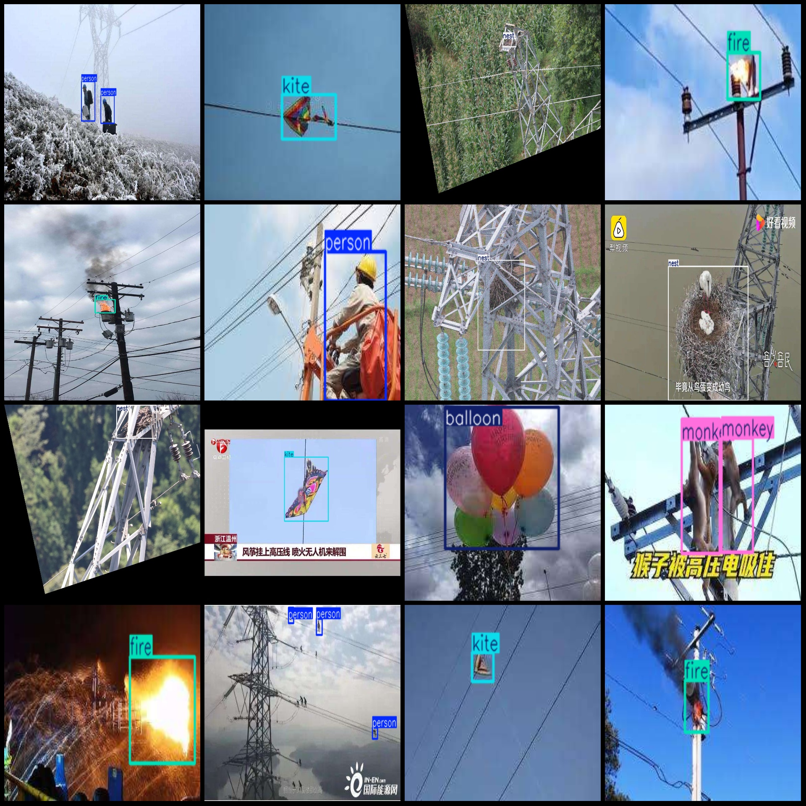
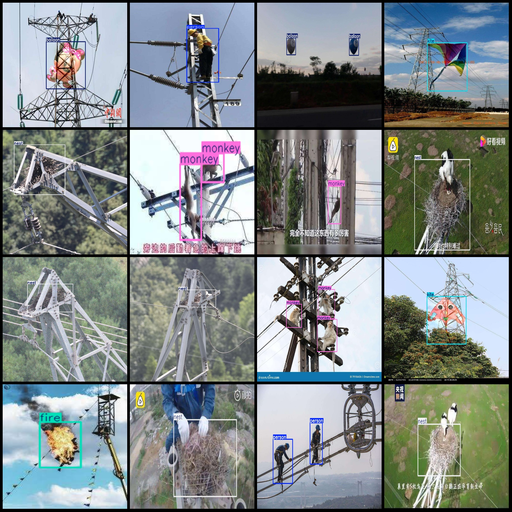

# Power Scene Transmission Line Foreign Object Detection Dataset (VOC+YOLO)

## Dataset Format
The dataset is in Pascal VOC format plus YOLO format (without the split path of the txt file, only containing JPG images and corresponding VOC format xml files and YOLO format txt files).

### Image Count:
Number of JPG files: 1331

### Annotation Count:
Number of xml files: 1331

### Annotation Count:
Number of txt files: 1331

### Number of Annotation Categories:
6 categories

### Annotation Category Names:
Note that the order of the YOLO format categories does not match this list, but it is based on the labels folder's classes.txt file.
- balloon: "balloon"
- fire: "fire"
- kite: "kite"
- monkey: "monkey"
- nest: "nest"
- person: "person"

Each category has a number of bounding boxes:
- balloon: 253
- fire: 239
- kite: 225
- monkey: 285
- nest: 342
- person: 277

Total bounding box count: 1621

### Image Resolutions:
Images are of multiple resolutions, such as 175x287, 1280x720, etc.

### Annotation Tool:
LabelImg used for annotation.

### Annotation Rules:
Draw a rectangle around the category.

### Special Remarks:
The dataset does not have separate training, validation, or test sets; you need to divide them yourself.

### Special Disclaimer:
This dataset does not guarantee any accuracy in the trained models or weights files.

### Image Preview:

---
annotation example:
## Images

Here is a pay link on Stripe ( https://buy.stripe.com/3cs8yP7sY87d0vu9AB ). Please contact me lonlonago@foxmail.com after funding $89, and I will send you a complete data files , thank you!

